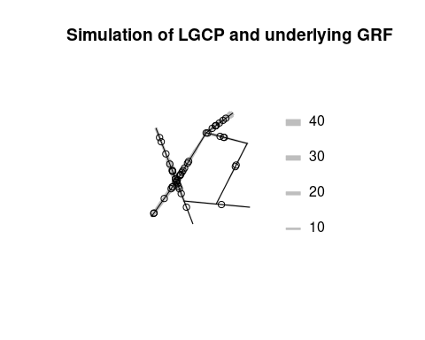

<!-- README.md is generated from README.Rmd. Please edit that file -->

# coxln

<!-- badges: start -->
<!-- badges: end -->

The goal of coxln is to simulate and model point pattern data on linear
networks using various classes of Cox point processes, specifically:

- Log Gaussian Cox processes
- Interrupted Cox processes
- Permanental Cox point processes

The package contains different algorithms for simulating these Cox
processes, as well as the underlying Gaussian processes. Furthermore it
contains algorithms for calculating summary statistics (F, G, J and pcf)
using either geodesic or resistance metric, which is useful for
parameter estimation and model checking.

## Installation

You can install the development version of coxln from
[GitHub](https://github.com/) with:

``` r
# install.packages("devtools")
devtools::install_github("gulddahl/coxln",dependencies=TRUE,build_vignettes=TRUE)
```

## Examples

The first example shows how to simulate a log Gaussian Cox process with
exponential covariance function and geodesic metric on a linear network
called simplenet (from the spatstat package) using a grid on the
network.

``` r
library(coxln)
#> Loading required package: spatstat
#> Loading required package: spatstat.data
#> Loading required package: spatstat.geom
#> spatstat.geom 3.2-7
#> Loading required package: spatstat.random
#> spatstat.random 3.2-2
#> Loading required package: spatstat.explore
#> Loading required package: nlme
#> spatstat.explore 3.2-5
#> Loading required package: spatstat.model
#> Loading required package: rpart
#> spatstat.model 3.2-8
#> Loading required package: spatstat.linnet
#> spatstat.linnet 3.1-3
#> 
#> spatstat 3.0-7 
#> For an introduction to spatstat, type 'beginner'
pos = makepos(spatstat.data::simplenet,50)
covfunc = covfunctypes("expcov",1)
X = simCPLNDisc(pos,covfunc,sigma=1,transform="lgcp",rho=20)
plot(attr(X,"Lambda"),style="width",col="grey",main="Simulation of LGCP and underlying GRF")
plot(X,add=TRUE)
```



The second example shows how to estimate the F-function from the data
set spiders (also from the spatstat package) using the resistance
metric:

``` r
library(coxln)
X = spatstat.data::spiders
r = seq(0,250,length.out=50)
ppul = 0.02
F = linearF(X,r,ppul,metric="R")
plot(F)
```


The final example shows how to estimate the parameters of a log Gaussian
Cox process with an exponential covariance function and the resistance
metric on the spiders data using minimum contrast estimation based on
the pair correlation function:

``` r
library(coxln); library(spatstat)
r = seq(0,500,length.out=50)
gest = linearpcfR(spatstat.data::spiders,r)
g = paircorfunc("expcov","lgcp")
MCE = mincontrast(gest,g,c(0.1,0.1),ctrl=list(rmin=100,rmax=300))
param = c(sigma=MCE$par[1],s=MCE$par[2])
plot(gest,legend=FALSE,xlim=c(100,300),ylim=c(0.5,1.5))
curve(g(param,x),col="green",add=TRUE)
```


The estimated parameters are now stored in param, which in this case is
given by (sigma,s) = (0.8577, 0.0099), i.e. the standard deviation of
the underlying Gaussian random field and the scaling parameter of the
exponential covariance function.

# Vignette

An example of how to do a statistical analysis of a dataset using the
functions from the coxln package is provided in the vignette for this
package:

``` r
vignette("coxln")
```
